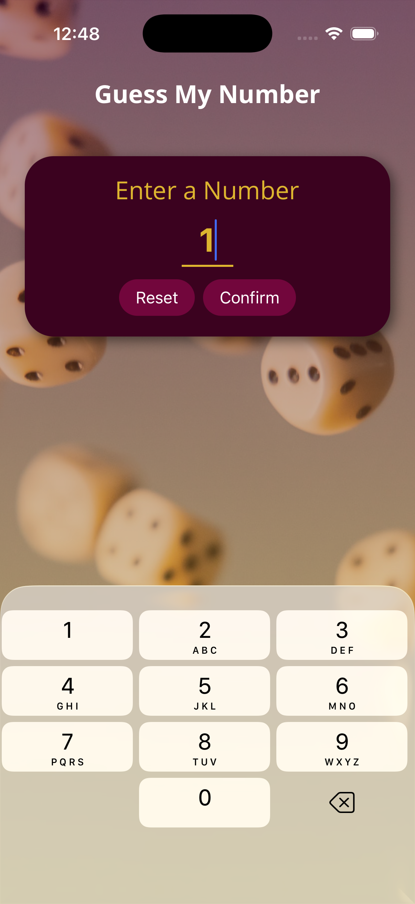
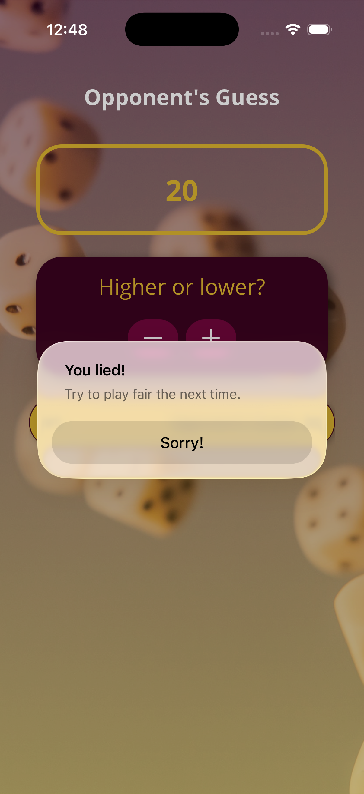
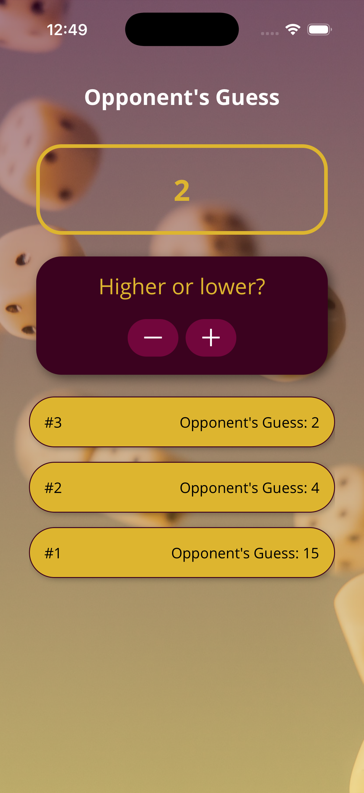
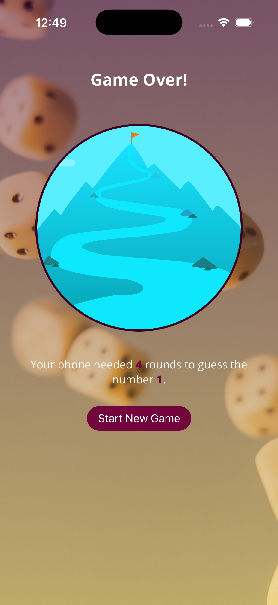

# Mini Game

Mini Game offers a quick play loop that is easy to pick up and replay. Pick a number from 1 to 99 and see how many times it takes the computer to guess your number.

## Features

- Fast, replayable gameplay loop
- Touch-friendly controls and animations
- Minimalist visual style suitable for mobile screens

## How to play

1. Open the app to land on the main screen with a clear call-to-action to start a new round.
2. Choose a number from 1 to 99 and click on "Confirm".
3. Give clues to the computer if the number it guessed is smaller/bigger than the number you chose.
4. See the result at the end of the round and restart for another attempt.

## Screenshots

<div align="center">
  
  
  
  
</div>

## Installation

This project is built with JavaScript and React Native and can be run with Expo.

1. Prerequisites

   - Node.js (LTS recommended)
   - npm or Yarn
   - Expo CLI (optional but recommended): `npm install -g expo-cli` or use `npx expo`

2. Clone and install

   ```bash
   git clone https://github.com/andrei1sirbu/mini-game-mobile-app.git
   cd mini-game-mobile-app
   npm install
   # or
   yarn
   ```

3. Start the development server

   ```bash
   npx expo start
   # or
   npm start
   ```

4. Run on a device or simulator
   - Use the Expo Go app on iOS/Android and scan the QR code shown by the dev server.
   - Or run on a simulator:
     - Android: `npx expo run:android`
     - iOS (macOS + Xcode): `npx expo run:ios`

If your local copy uses React Native CLI instead of Expo, use:

```bash
npx react-native run-android
npx react-native run-ios
```

## Tech stack

- JavaScript (ES6+)
- React Native
- Expo (optional, if project is Expo-managed)

## Project structure

- App.js — main application component and root UI
- index.js — bundler entrypoint
- app.json — Expo configuration (if present)
- components/ — UI and game components
- assets/ — images, icons, and other static files
- package.json / package-lock.json — dependencies and scripts
